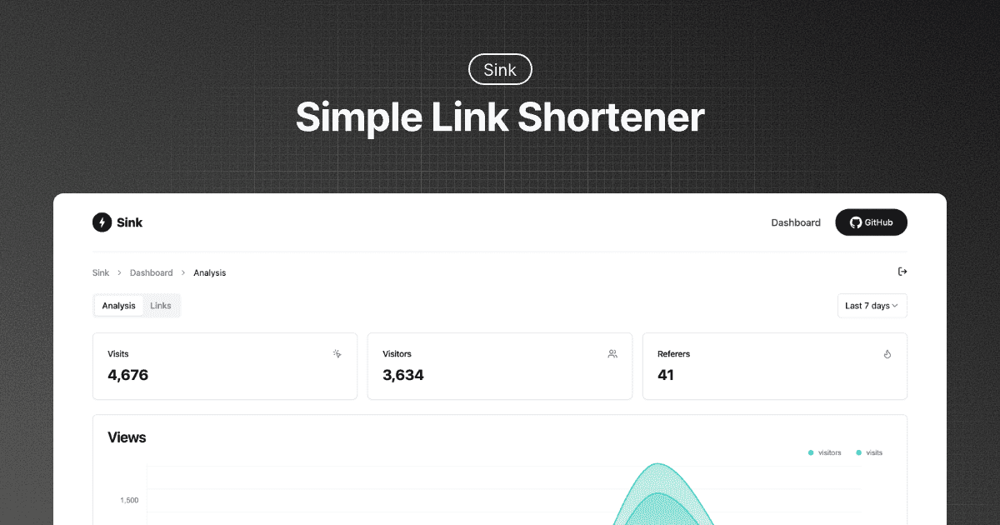

# ⚡ Sink

**A Simple / Speedy / Secure Link Shortener with Analytics, 100% run on Cloudflare.**

---

## ✨ Features

- **🔗 URL Shortening:** Compress your URLs to their minimal length.
- **📈 Analytics:** Monitor link analytics and gather insightful statistics.
- **☁️ Serverless:** Deploy without the need for traditional servers.
- **🎨 Customizable Slug:** Support personalized slugs, UTM parameters, and case sensitivity.
- **🪄 AI Assistance:** Generate slugs and OpenGraph metadata from page content.
- **⏰ Link Control:** Set expirations, passwords, and unsafe-link warning pages.
- **📱 Smart Routing:** Redirect visitors by device or country.
- **🖼️ Social Preview:** Customize social previews with titles, descriptions, and images.
- **📊 Real-time Analytics:** Live 3D globe and real-time event logs.
- **🔲 QR Code:** Generate QR codes for your short links.
- **📦 Import/Export:** Bulk link migration via JSON and access analytics via CSV.
- **🌍 Multi-language:** Full i18n support for dashboard and redirect pages.

## 🧱 Technologies Used

- **Framework**: [Nuxt](https://nuxt.com/)
- **Database**: [Cloudflare Workers KV](https://developers.cloudflare.com/kv/)
- **Analytics Engine**: [Cloudflare Workers Analytics Engine](https://developers.cloudflare.com/analytics/)
- **UI Components**: [shadcn-vue](https://www.shadcn-vue.com/)
- **Styling:** [Tailwind CSS](https://tailwindcss.com/)
- **Deployment**: [Cloudflare](https://www.cloudflare.com/)

## 🚗 Roadmap [WIP]

We welcome your contributions and PRs.

- [x] Browser Extension - [Sink Tool](https://github.com/zhuzhuyule/sink-extension)
- [x] Chrome Extension - [Sink Quick Shorten](https://chromewebstore.google.com/detail/sink-quick-shorten/emlojomjpenjgkaphajcokijobpkejih)
- [x] Raycast Extension - [Raycast-Sink](https://github.com/foru17/raycast-sink)
- [x] Apple Shortcuts - [Sink Shortcuts](https://s.search1api.com/sink001)
- [x] iOS App - [Sink](https://apps.apple.com/app/id6745417598)
- [ ] Enhanced Link Management (with Cloudflare D1)
- [ ] Analytics Enhancements (Support for merging filter conditions)
- [x] Dashboard Performance Optimization (Infinite loading)
- [x] API, migration, backup, and redirect tests

## 🏗️ Deployment

We currently support deployment to [Cloudflare Workers](./docs/deployment/workers.md) (recommended) and [Cloudflare Pages](./docs/deployment/pages.md).

## ⚒️ Configuration

[Configuration Docs](./docs/configuration.md)

## 🔌 API

[API Docs](./docs/api.md)

## 🙋🏻 FAQs

[FAQs](./docs/faqs.md)

## 💖 Credits

1. [**Cloudflare**](https://www.cloudflare.com/)
2. [**NuxtHub**](https://hub.nuxt.com/)
3. [**Astroship**](https://astroship.web3templates.com/)
4. [**Tailark**](https://tailark.com/)
